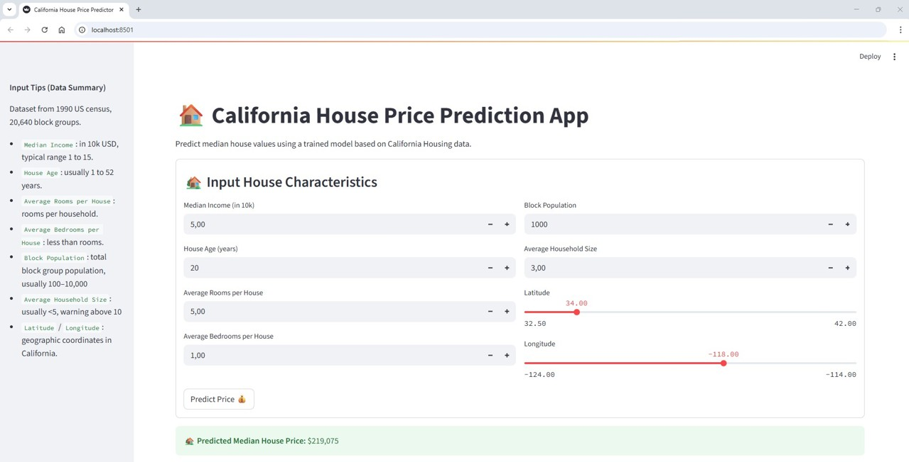

# 🏠California House Price Predictor

This project implements a comprehensive **machine learning pipeline** to **predict median house prices in California** based on census data. It includes data preprocessing, feature engineering, model training and evaluation with multiple regression algorithms, and deployment as a **Streamlit web app** with interactive prediction and mapping.

## Streamlit web app

| Streamlit web app                          |
| ------------------------------------------ |
|          |
|        |
|        |


## 📁 Project Structure

- `California_House_Price_Prediction.ipynb`: Jupyter Notebook, who exploratory analysis and model experimentation
- `train_model.py`: Model training pipeline: preprocessing, training, evaluation, saving best model
- `api.py`: Model inference logic: prediction, feature engineering, logging
- `app.py`: # Streamlit web app: UI for predictions and map visualization
- `best_model_Stacking_Linear+Tree+Cat_2025_07_20.pkl`: Saved best model (scaler + regressor)
- `prediction_history.csv`: Log of all user predictions made via the app


## 🛠️ Requirements

Install the necessary libraries:

```bash
pip install pandas numpy matplotlib seaborn plotly scikit-learn statsmodels scipy xgboost lightgbm catboost folium streamlit-folium streamlit
```


## 📂 Dataset

We use the [fetch_california_housing](https://scikit-learn.org/stable/modules/generated/sklearn.datasets.fetch_california_housing.html) dataset from `scikit-learn`, which is based on the 1990 U.S. Census data.
- 📌 Size: 20,640 samples (block groups) with 8 numerical features
- 🎯 Target: `MedHouseVal`: the median house value (in $100,000s) for households within a block
- 📍 Geographic Scope: California state (includes latitude and longitude)
- 🧮 Features:
    - `MedInc`: Median income in block group (10k USD units)
    - `HouseAge`: Median age of houses in block group
    - `AveRooms`: Average number of rooms per household
    - `AveBedrms`: Average number of bedrooms per household
    - `Population`: Total population of the block group
    - `AveOccup`: Average household occupancy
    - `Latitude` / `Longitude`: Geographic coordinates

The dataset is automatically downloaded using `scikit-learn`:
```bash
from sklearn.datasets import fetch_california_housing
housing = fetch_california_housing()
```


## 🧠 Model Used

A wide variety of regression models are trained and evaluated, including:
- **Linear Models**: LinearRegression, Ridge, Lasso, ElasticNet, BayesianRidge
- **Tree-Based Models**: DecisionTree, RandomForest, ExtraTrees, GradientBoosting, HistGradientBoosting
- **Boosting**: XGBoost, LightGBM, CatBoost, AdaBoost
- **Others**: SVR, KNN, HuberRegressor, MLPRegressor (Neural Network)
- **Stacking Regressors**: Multiple combinations of base learners and meta-models for ensemble learning


## 📊 Model Performance Metrics
Each model is evaluated using:
- **MAE (Mean Absolute Error)**: Average magnitude of prediction error
-**MSE (Mean Squared Error)**: Penalizes larger errors more than MAE
- **RMSE (Root Mean Squared Error)**: Interpretable in target units
- **R² Score (Coefficient of Determination)**: Indicates goodness of fit
- **Cross-Validation R²**: Mean R² score across folds for generalization check

The model with the best test R² score is automatically selected and saved for deployment.


## 📘 Language

- Python